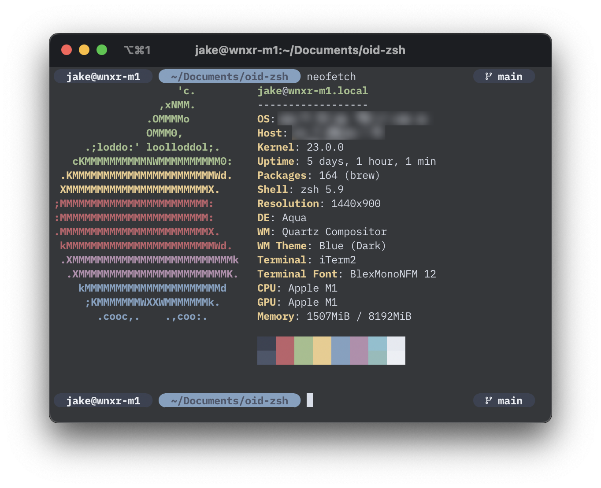

# oid.zsh-theme



* Renders beautiful rounded circles on information.
* Renders current git branch.
* Renders `user@hostname`.
* Renders current directory.

## Installation

```
git clone https://github.com/jakehwll/oid-zsh-theme
ln -s ./oid.zsh-theme ~/.oh-my-zsh/themes/
```

Then update your `.zshrc` to use `ZSH_THEME="oid"`

```diff
# Set name of the theme to load --- if set to "random", it will
# load a random theme each time oh-my-zsh is loaded, in which case,
# to know which specific one was loaded, run: echo $RANDOM_THEME
# See https://github.com/ohmyzsh/ohmyzsh/wiki/Themes
- ZSH_THEME="robbyrussell"
+ ZSH_THEME="oid"
```

> **Note** You will need a [nerd fonts](https://www.nerdfonts.com/font-downloads) font for the rounded circles and git branch icon to render correctly. I recommend `BlexMono Nerd Font`.